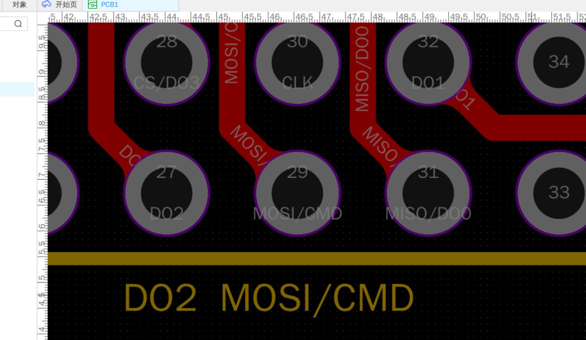

[简体中文](./README.md) | [English](./README.en.md) | [繁體中文](./README.zh-Hant.md) | [日本語](./README.ja.md) | [Русский](./README.ru.md)

# Silkscreen Generator

A silkscreen helper extension for the PCB page in JLCEDA Pro / EasyEDA Pro. It can automatically generate silkscreen text from the net names of selected pads, and provides pad avoidance, unified text direction, font selection, and fixed font size settings.

## Features

### Menu

### Generate Net Silkscreen

- Select components, component pads, or free pads in a PCB document to read their net names and generate silkscreen text automatically
- Automatically decide whether the text should be created on the top or bottom silkscreen layer based on pad layer, component layer, and net-related objects
- Automatically ignore empty nets and auto-named nets such as `N$`, `Net-`, `unconnected`, and `nc`
- Run one round of pad avoidance immediately after generation

### One-click Pad Avoidance

- Prefer the currently selected silkscreen texts
- If no silkscreen text is selected, continue with the most recent texts generated by this extension
- If there is still no target, process all top and bottom silkscreen texts in the current PCB

### Unify Text Direction

- Set top silkscreen text to `0°`
- Set bottom silkscreen text to `180°`
- Run pad avoidance again after direction updates

### Demo

## Usage

1. Open a PCB document in JLCEDA / EasyEDA Pro.
2. Open the extension menu from the top bar: `PCB -> 丝印生成器`.
3. Use the following commands as needed:

   - `生成网络丝印` (Generate Net Silkscreen): select components, component pads, or free pads first
   - `一键避让焊盘` (One-click Pad Avoidance): optionally select the silkscreen texts you want to process first
   - `统一文字方向` (Unify Text Direction): optionally select the silkscreen texts you want to process first
   - `设置字体` (Set Font): choose a font from the font list available in the application
   - `设置固定字号` (Set Fixed Font Size): enter a number greater than `0`

4. After automatic processing, manually review and fine-tune dense package areas when needed.

## License

This project is released under [Apache License 2.0](./LICENSE).
